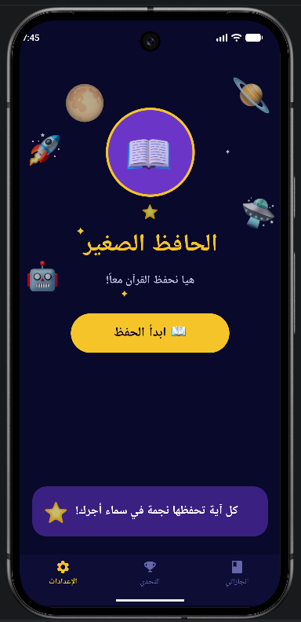
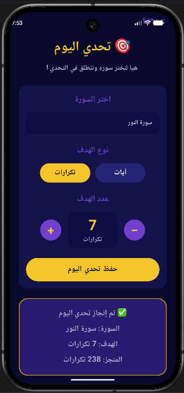
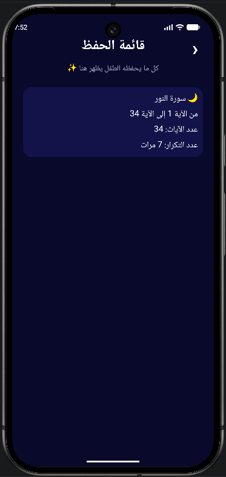

# 📖 Al-Hafiz Al-Saghir | الحافظ الصغير

**Al-Hafiz Al-Saghir** is an Android application designed to support Quran memorization through structured repetition, progress tracking, daily challenges, and Quran recitation.

The application provides an interactive memorization experience where users can select a Surah and a range of verses, choose the number of repetitions, listen to recitations, view the current verse, and track their memorization progress.

## 📸 Screenshots

### Home Screen


### Challenge Screen


### Achievements Screen


## ✨ Features

*  Browse and select Quran Surahs.
*  Select a specific range of verses for memorization.
*  Customize the number of repetitions during a memorization session.
*  Listen to Quran verse recitations.
*  Display the current Quran verse during the memorization session.
*  Track memorization progress throughout each session.
*  Save and resume memorization progress.
*  View previously completed memorization sessions.
*  Create daily memorization challenges based on:

  * Number of repetitions.
  * Number of verses.
*  Track progress toward daily challenges.
*  Support for light and dark themes.
*  Application settings for a more personalized experience.

## Technologies Used

### Language & Platform

* **Java**
* **Android Studio**
* **Android SDK**

### Data & Backend

* **SQLite**
* **Firebase Realtime Database**
* **REST APIs**

### Libraries & Android Components

* **Retrofit** — API communication.
* **Gson** — JSON data conversion.
* **Glide** — Image loading.
* **MediaPlayer** — Audio playback.
* **RecyclerView** — Efficient list display.
* **ViewPager2** — Page-based navigation.

## 🌐 APIs & External Services

The application integrates with external Quran services to retrieve Quran-related content required by the application.

### Al Quran Cloud API

Used with Retrofit to retrieve Quran and Surah data.

### Quran Audio Services

External Quran resources are used to provide verse recitations, allowing users to listen to verses repeatedly during memorization sessions.

## 💾 Data Storage

The application uses **SQLite** for local data management.

Local storage is used to maintain:

* Quran verse information.
* Current memorization progress.
* Daily challenge information and progress.
* Completed memorization sessions.

The project also integrates **Firebase Realtime Database** for storing and retrieving memorization progress.

## 🧠 Memorization Workflow

1. Select a Surah.
2. Choose the starting and ending verses.
3. Select the desired repetition count.
4. Start the memorization session.
5. View the current verse and listen to its recitation.
6. Repeat the verse according to the selected repetition count.
7. Continue through the selected range of verses while tracking session progress.
8. Complete the memorization session and save the progress.

## 📁 Project Structure

```text id="cc7j93"
com.example.hifzapp
│
├── api/
│   ├── ApiService
│   └── RetrofitClient
│
├── database/
│   ├── Ayah
│   ├── Challenge
│   ├── DatabaseHelper
│   └── Progress
│
├── firbase/
│   └── FirebaseManager
│
├── model/
│   ├── Surah
│   └── SurahResponse
│
├── adapter/
│   └── SurahAdapter
│
├── MainActivity
├── SurahListActivity
├── HifzSetupActivity
├── HifzActivity
├── HifzHistoryActivity
├── ChallengeActivity
├── CompletionActivity
├── SettingsActivity
└── AboutActivity
```

## 🚀 Getting Started

### Requirements

* Android Studio
* Android SDK 28 or later
* Internet connection for API-based Quran content and audio

### Installation

1. Clone the repository:

```bash id="qgzkuf"
git clone https://github.com/l7unx/Project-Quran-Hifz-App.git
```

2. Open the project in **Android Studio**.

3. Allow Gradle to synchronize and install the required dependencies.

4. Configure Firebase if required.

5. Run the application using an Android emulator or a physical Android device.

##  Academic Project

**Al-Hafiz Al-Saghir** was developed as a team project for the **Mobile Application Development** course.

The project aimed to apply mobile application development concepts by building a practical Android application that supports Quran memorization through repetition, audio recitation, progress tracking, and daily challenges.

## 👥 Team Project

The application was developed collaboratively as a team project.

### My Contribution

My main contributions to the project included:

* Designing and implementing parts of the application's **user interface**.
* Developing the **Daily Challenge feature**, allowing users to set memorization goals and track their progress.
* Contributing to and assisting with various parts of the application throughout the development process.

